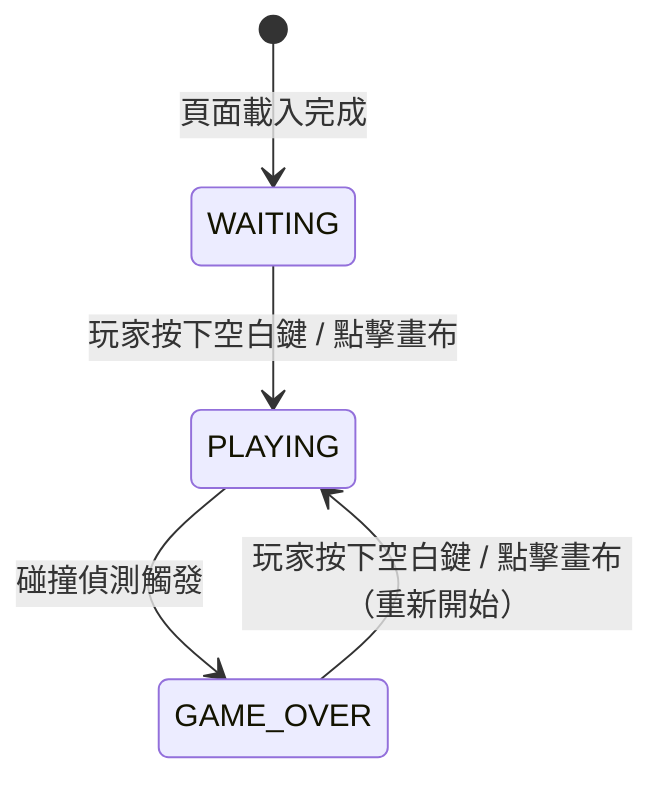
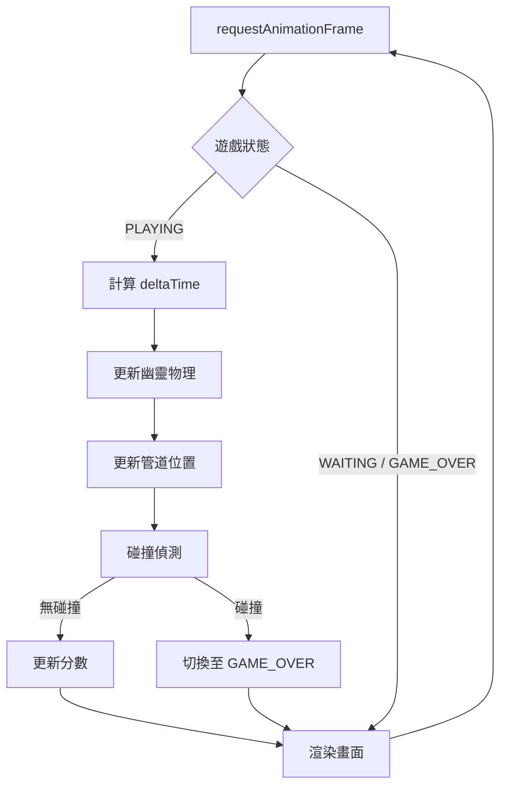
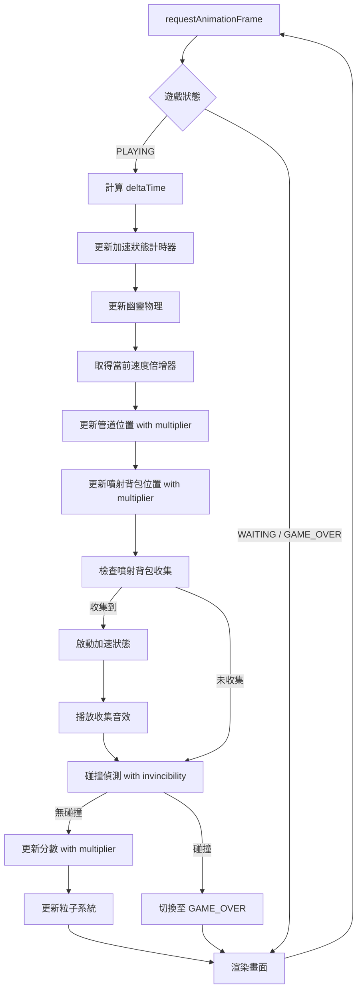

# 技術設計文件：Flappy Kiro

## 概覽

Flappy Kiro 是一款在瀏覽器中運行的復古風格橫向無限滾動遊戲，以單一 HTML 檔案實作，不依賴任何外部框架或伺服器。遊戲使用 HTML Canvas API 搭配原生 JavaScript 進行渲染與邏輯處理。

### 技術選型

| 項目 | 選擇 | 理由 |
|------|------|------|
| 渲染引擎 | HTML Canvas 2D API | 原生支援、無需框架、適合 2D 遊戲 |
| 程式語言 | 原生 JavaScript (ES6+) | 無需建置工具、單檔案部署 |
| 音效 | Web Audio API / HTML Audio | 瀏覽器原生支援 |
| 部署 | 單一 HTML 檔案 | 無需伺服器，直接開啟即可遊玩 |

### 遊戲迴圈概念

遊戲採用標準的「更新-渲染」迴圈（Game Loop），透過 `requestAnimationFrame` 驅動，確保畫面更新與瀏覽器刷新率同步。

---

## 架構

### 整體架構

遊戲採用單一 HTML 檔案結構，所有邏輯封裝於 `<script>` 標籤內。程式碼以模組化方式組織，分為以下幾個邏輯層：

```
index.html
├── <canvas id="gameCanvas">     ← 渲染目標
└── <script>
    ├── 常數定義（Constants）
    ├── 資源載入（Asset Loader）
    ├── 遊戲狀態（Game State）
    ├── 物理引擎（Physics）
    ├── 管道管理（Pipe Manager）
    ├── 碰撞偵測（Collision Detector）
    ├── 計分系統（Score System）
    ├── 音效系統（Audio System）
    ├── 渲染器（Renderer）
    └── 遊戲迴圈（Game Loop）
```

### 遊戲狀態機

遊戲在以下三種狀態之間轉換：



| 狀態 | 說明 |
|------|------|
| `WAITING` | 遊戲載入完成，顯示開始提示，等待玩家輸入 |
| `PLAYING` | 遊戲進行中，物理、管道、碰撞偵測全部啟用 |
| `GAME_OVER` | 遊戲結束，顯示結束畫面，等待重新開始輸入 |

### 遊戲迴圈流程



---

## 元件與介面

### 1. 常數定義（Constants）

集中管理所有遊戲參數，方便調整平衡性：

```javascript
const CONFIG = {
  // 畫布（擴大尺寸）
  CANVAS_WIDTH: 800,         // 從 480 增加至 800
  CANVAS_HEIGHT: 600,        // 從 640 調整至 600

  // 幽靈
  GHOST_X: 150,              // 幽靈固定水平位置（調整以適應新畫布）
  GHOST_WIDTH: 40,
  GHOST_HEIGHT: 40,
  GRAVITY: 0.5,              // 每幀重力加速度（像素/幀²）
  JUMP_VELOCITY: -9,         // 跳躍初速度（負值 = 向上）

  // 管道
  PIPE_WIDTH: 60,
  PIPE_GAP: 160,             // 上下管道間隙高度
  PIPE_SPEED: 3,             // 管道每幀移動像素（正常速度）
  PIPE_SPAWN_INTERVAL: 1800, // 管道生成間隔（毫秒）
  PIPE_MIN_HEIGHT: 60,       // 管道最小高度
  PIPE_MAX_HEIGHT: 320,      // 管道最大高度（上管道）

  // 噴射背包
  JETPACK_WIDTH: 30,
  JETPACK_HEIGHT: 30,
  JETPACK_SPAWN_INTERVAL: 3, // 每通過 3-5 組管道生成一個
  JETPACK_SPAWN_VARIANCE: 2,  // 生成間隔隨機變化範圍
  JETPACK_GLOW_SPEED: 0.05,   // 閃爍效果速度

  // 加速狀態
  ACCELERATION_DURATION: 5000,  // 加速持續時間（毫秒）
  ACCELERATION_SPEED_MULTIPLIER: 2.5, // 管道速度倍增器
  SCORE_MULTIPLIER: 2,          // 分數倍增器
  
  // 粒子系統
  FLAME_PARTICLE_COUNT: 3,      // 每幀生成的火焰粒子數
  FLAME_PARTICLE_LIFETIME: 500, // 粒子存活時間（毫秒）
  FLAME_PARTICLE_SPEED: 4,      // 粒子向後移動速度
  RAINBOW_TRAIL_LENGTH: 15,     // 彩虹軌跡點數
  SPEED_LINE_COUNT: 8,          // 速度線數量
  SPEED_LINE_LENGTH: 100,       // 速度線長度

  // 視覺
  BG_COLOR: '#a8d8ea',       // 淡藍色背景
  PIPE_COLOR: '#4caf50',     // 綠色管道
  SCORE_BAR_HEIGHT: 40,      // 底部分數欄高度
  SCORE_BAR_COLOR: '#2c2c2c',
  TIMER_COLOR: '#ff6b6b',    // 倒數計時器顏色
  TIMER_FONT: 'bold 24px monospace',

  // 音效
  JUMP_SOUND: 'assets/jump.wav',
  GAME_OVER_SOUND: 'assets/game_over.wav',
  JETPACK_COLLECT_SOUND: 'assets/jetpack_collect.wav',
  ACCELERATION_MUSIC: 'assets/acceleration_music.wav',

  // 圖片
  GHOST_IMAGE: 'assets/ghosty.png',
  JETPACK_IMAGE: 'jetpack.png',
};
```

### 2. 資源載入器（Asset Loader）

負責預載圖片與音效，確保遊戲開始前所有資源就緒：

```javascript
// 介面
assetLoader.loadAll(onComplete: () => void): void
assetLoader.getImage(key: string): HTMLImageElement
assetLoader.getAudio(key: string): HTMLAudioElement
```

### 3. 遊戲狀態物件（Game State）

持有所有可變的遊戲執行時狀態：

```javascript
// 介面
gameState.reset(): void                    // 重置為初始狀態（保留 highScore 與會話統計）
gameState.setState(s: string): void
gameState.getState(): string
gameState.isAccelerating(): boolean        // 檢查是否處於加速狀態
gameState.startAcceleration(): void        // 啟動加速狀態
gameState.updateAcceleration(dt): void     // 更新加速計時器
gameState.getAccelerationTimeLeft(): number // 取得剩餘加速時間（毫秒）
gameState.getScoreMultiplier(): number     // 取得當前分數倍增器
gameState.incrementJetpackCount(): void    // 增加噴射背包收集計數
gameState.getJetpackStats(): {collected, longestStreak} // 取得噴射背包統計
```

### 4. 幽靈控制器（Ghost Controller）

管理幽靈的物理狀態與渲染：

```javascript
// 介面
ghost.reset(): void              // 重置至初始位置與速度
ghost.jump(): void               // 施加向上速度
ghost.update(): void             // 套用重力，更新位置
ghost.render(ctx): void          // 繪製幽靈圖片
ghost.getBounds(): Rect          // 取得碰撞邊界框
```

### 5. 管道管理器（Pipe Manager）

負責管道的生成、移動與回收：

```javascript
// 介面
pipeManager.reset(): void                  // 清除所有管道，重置計時器
pipeManager.update(dt, speedMultiplier): void // 移動管道、生成新管道、回收離屏管道（支援速度倍增）
pipeManager.render(ctx): void              // 繪製所有管道
pipeManager.getPipes(): Pipe[]             // 取得當前所有管道
pipeManager.spawnPipe(): void              // 生成一組新管道（隨機垂直位置）
pipeManager.getPipesPassedCount(): number  // 取得已通過的管道總數（用於噴射背包生成判斷）
```

### 6. 碰撞偵測器（Collision Detector）

純函式，無副作用：

```javascript
// 介面
checkCollision(ghost: Rect, pipes: Pipe[], canvasHeight: number, isInvincible: boolean): boolean
rectOverlap(a: Rect, b: Rect): boolean
checkJetpackCollection(ghost: Rect, jetpacks: Jetpack[]): Jetpack | null
```

### 7. 計分系統（Score System）

追蹤分數並判斷是否通過管道：

```javascript
// 介面
scoreSystem.reset(): void                          // 重置當前分數（保留最高分）
scoreSystem.update(ghost, pipes, multiplier): void // 判斷是否通過管道並加分（支援倍增器）
scoreSystem.getScore(): number
scoreSystem.getHighScore(): number
scoreSystem.render(ctx): void                      // 在底部欄渲染分數文字
```

### 8. 音效系統（Audio System）

封裝音效播放，並處理瀏覽器播放失敗的情況：

```javascript
// 介面
audioSystem.play(key: string): void           // 播放音效，失敗時靜默忽略
audioSystem.playLoop(key: string): void       // 循環播放音效（用於加速音樂）
audioSystem.stop(key: string): void           // 停止播放指定音效
audioSystem.stopAll(): void                   // 停止所有音效
```

### 9. 噴射背包管理器（Jetpack Manager）

負責噴射背包的生成、移動與收集：

```javascript
// 介面
jetpackManager.reset(): void                  // 清除所有噴射背包，重置計數器
jetpackManager.update(dt, speedMultiplier, pipesPassedCount): void // 更新位置、判斷生成時機
jetpackManager.render(ctx, time): void        // 繪製噴射背包（含閃爍效果）
jetpackManager.getJetpacks(): Jetpack[]       // 取得當前所有噴射背包
jetpackManager.removeJetpack(jetpack): void   // 移除指定噴射背包
jetpackManager.spawnJetpack(): void           // 在隨機高度生成噴射背包
```

### 10. 粒子系統（Particle System）

管理視覺效果粒子（火焰、彩虹軌跡、速度線）：

```javascript
// 介面
particleSystem.reset(): void                  // 清除所有粒子
particleSystem.emitFlame(x, y): void          // 在指定位置發射火焰粒子
particleSystem.addTrailPoint(x, y): void      // 添加彩虹軌跡點
particleSystem.update(dt): void               // 更新所有粒子狀態
particleSystem.renderFlames(ctx): void        // 渲染火焰粒子
particleSystem.renderTrail(ctx): void         // 渲染彩虹軌跡
particleSystem.renderSpeedLines(ctx, ghostY): void // 渲染速度線
```

### 11. UI 系統（UI System）

負責遊戲 UI 元素的渲染：

```javascript
// 介面
uiSystem.renderTimer(ctx, timeLeft): void     // 渲染加速倒數計時器
uiSystem.renderStats(ctx, stats): void        // 渲染噴射背包統計（遊戲結束畫面）
uiSystem.renderMultiplier(ctx, multiplier): void // 渲染分數倍增器指示
```

### 9. 渲染器（Renderer）

負責背景、雲朵、素描紋理等裝飾性渲染：

```javascript
// 介面
renderer.drawBackground(ctx): void   // 淡藍色背景 + 素描紋理
renderer.drawClouds(ctx): void       // 白色圓角矩形雲朵
renderer.drawScoreBar(ctx): void     // 底部深色橫條
renderer.drawWaitingScreen(ctx): void
renderer.drawGameOverScreen(ctx, score, highScore, jetpackStats): void // 包含噴射背包統計
```

---

## 資料模型

### Rect（邊界框）

```javascript
/**
 * @typedef {Object} Rect
 * @property {number} x      - 左上角 X 座標
 * @property {number} y      - 左上角 Y 座標
 * @property {number} width  - 寬度
 * @property {number} height - 高度
 */
```

### Ghost（幽靈狀態）

```javascript
/**
 * @typedef {Object} Ghost
 * @property {number} x        - 固定水平位置（像素）
 * @property {number} y        - 當前垂直位置（像素）
 * @property {number} vy       - 當前垂直速度（像素/幀，正值向下）
 * @property {number} width    - 碰撞寬度
 * @property {number} height   - 碰撞高度
 */
```

### Pipe（管道組）

```javascript
/**
 * @typedef {Object} Pipe
 * @property {number}  x          - 管道左側 X 座標（隨時間減少）
 * @property {number}  topHeight  - 上管道高度（從畫布頂部向下）
 * @property {number}  gapY       - 間隙頂部 Y 座標（= topHeight）
 * @property {number}  gapHeight  - 間隙高度（固定值 CONFIG.PIPE_GAP）
 * @property {boolean} scored     - 是否已計分（防止重複計分）
 */
```

### Jetpack（噴射背包）

```javascript
/**
 * @typedef {Object} Jetpack
 * @property {number} x        - 噴射背包 X 座標
 * @property {number} y        - 噴射背包 Y 座標
 * @property {number} width    - 碰撞寬度
 * @property {number} height   - 碰撞高度
 * @property {number} glowPhase - 閃爍效果相位（0-2π）
 */
```

### FlameParticle（火焰粒子）

```javascript
/**
 * @typedef {Object} FlameParticle
 * @property {number} x         - 粒子 X 座標
 * @property {number} y         - 粒子 Y 座標
 * @property {number} vx        - 水平速度（向後）
 * @property {number} vy        - 垂直速度（隨機擾動）
 * @property {number} life      - 剩餘存活時間（毫秒）
 * @property {number} maxLife   - 初始存活時間（毫秒）
 * @property {string} color     - 粒子顏色（橙色/黃色漸變）
 */
```

### TrailPoint（軌跡點）

```javascript
/**
 * @typedef {Object} TrailPoint
 * @property {number} x         - 軌跡點 X 座標
 * @property {number} y         - 軌跡點 Y 座標
 * @property {number} age       - 軌跡點年齡（0-1，用於淡出）
 * @property {string} color     - 彩虹色彩（HSL 格式）
 */
```

### GameState（遊戲狀態）

```javascript
/**
 * @typedef {Object} GameState
 * @property {'WAITING'|'PLAYING'|'GAME_OVER'} status - 當前遊戲狀態
 * @property {number} score           - 當前分數
 * @property {number} highScore       - 本次會話最高分
 * @property {Ghost}  ghost           - 幽靈物件
 * @property {Pipe[]} pipes           - 當前所有管道
 * @property {Jetpack[]} jetpacks     - 當前所有噴射背包
 * @property {number} lastPipeTime    - 上次生成管道的時間戳（毫秒）
 * @property {boolean} isAccelerating - 是否處於加速狀態
 * @property {number} accelerationTimeLeft - 剩餘加速時間（毫秒）
 * @property {number} jetpacksCollected - 本局收集的噴射背包數
 * @property {number} currentStreak   - 當前連擊數
 * @property {number} longestStreak   - 最長連擊數（會話記錄）
 * @property {number} totalJetpacks   - 會話總收集數
 */
```

### Cloud（雲朵裝飾）

```javascript
/**
 * @typedef {Object} Cloud
 * @property {number} x      - 雲朵中心 X 座標
 * @property {number} y      - 雲朵中心 Y 座標
 * @property {number} width  - 雲朵寬度
 * @property {number} height - 雲朵高度
 */
```

### AccelerationState（加速狀態）

```javascript
/**
 * @typedef {Object} AccelerationState
 * @property {boolean} active         - 加速是否啟用
 * @property {number} timeRemaining   - 剩餘時間（毫秒）
 * @property {number} speedMultiplier - 速度倍增器
 * @property {number} scoreMultiplier - 分數倍增器
 */
```

---

## 噴射背包系統整合

### 加速狀態管理

加速狀態由 `gameState` 模組集中管理，包含以下邏輯：

1. **啟動加速**：當收集到噴射背包時，呼叫 `gameState.startAcceleration()`
   - 設定 `isAccelerating = true`
   - 初始化 `accelerationTimeLeft = ACCELERATION_DURATION`
   - 增加噴射背包計數與連擊數
   - 觸發音效與視覺效果

2. **更新加速**：每幀呼叫 `gameState.updateAcceleration(dt)`
   - 減少 `accelerationTimeLeft`
   - 當時間歸零時自動結束加速狀態
   - 重置連擊數（如果未在時間內收集下一個噴射背包）

3. **加速效果**：
   - 管道速度倍增：`PIPE_SPEED * ACCELERATION_SPEED_MULTIPLIER`
   - 分數倍增：通過管道時 `+2` 而非 `+1`
   - 無敵狀態：碰撞偵測跳過管道檢查（但仍檢查畫布邊界）

### 噴射背包生成邏輯

噴射背包生成由 `jetpackManager` 根據已通過的管道數量決定：

```javascript
// 偽代碼
if (pipesPassedCount > 0 && pipesPassedCount % (10 + random(0, 5)) === 0) {
  jetpackManager.spawnJetpack();
}
```

- 每通過 3-5 組管道生成一個噴射背包
- 生成位置：X = 畫布右側，Y = 隨機高度（避免過於靠近邊界）
- 移動速度：與管道相同（受加速狀態影響）

### 粒子系統架構

粒子系統採用物件池模式，避免頻繁記憶體分配：

1. **火焰粒子**：
   - 每幀從噴射背包位置發射 3 個粒子
   - 粒子向後移動（負 X 方向）並隨機擾動（Y 方向）
   - 顏色在橙色（`#ff6b00`）與黃色（`#ffff00`）之間隨機
   - 透明度隨存活時間線性衰減

2. **彩虹軌跡**：
   - 每幀在幽靈位置添加一個軌跡點
   - 保持最多 15 個軌跡點（FIFO 佇列）
   - 顏色使用 HSL 色彩空間，色相隨時間變化（`hsl(hue, 100%, 50%)`）
   - 透明度隨軌跡點年齡衰減

3. **速度線**：
   - 8 條水平線，均勻分佈於畫布高度
   - 從幽靈後方向左延伸
   - 使用半透明白色渲染

### 碰撞偵測更新

碰撞偵測函式新增 `isInvincible` 參數：

```javascript
function checkCollision(ghost, pipes, canvasHeight, isInvincible) {
  // 邊界檢查（始終啟用）
  if (ghost.y < 0 || ghost.y + ghost.height > canvasHeight) {
    return true;
  }
  
  // 管道碰撞（加速時跳過）
  if (!isInvincible) {
    for (const pipe of pipes) {
      if (rectOverlap(ghost, getPipeTopRect(pipe)) || 
          rectOverlap(ghost, getPipeBottomRect(pipe))) {
        return true;
      }
    }
  }
  
  return false;
}
```

### UI 元件整合

1. **倒數計時器**：
   - 位置：畫布右上角
   - 格式：`⏱ 3.2s`
   - 顏色：紅色（`#ff6b6b`）
   - 僅在加速狀態時顯示

2. **分數倍增器指示**：
   - 位置：分數旁邊
   - 格式：`×2`
   - 顏色：金色（`#ffd700`）
   - 僅在加速狀態時顯示

3. **噴射背包統計**（遊戲結束畫面）：
   - 顯示本局收集數
   - 顯示最長連擊數
   - 顯示會話總收集數

### 音效整合

音效系統新增循環播放功能：

- **收集音效**：單次播放，短促的「叮」聲
- **加速音樂**：循環播放，快節奏背景音樂
- **結束處理**：加速狀態結束時停止循環音樂

---

## 更新後的遊戲迴圈



### 渲染順序

為確保視覺效果正確疊加，渲染順序如下：

1. 背景（淡藍色 + 素描紋理）
2. 雲朵裝飾
3. 管道
4. 噴射背包（含閃爍效果）
5. 彩虹軌跡（在幽靈後方）
6. 幽靈圖片
7. 火焰粒子（在幽靈前方）
8. 速度線（最前層）
9. 分數欄
10. UI 元素（計時器、倍增器）
11. 遊戲狀態覆蓋層（等待/結束畫面）

---

## 效能考量

### 粒子系統最佳化

- 使用物件池避免頻繁 GC
- 限制最大粒子數量（火焰：50 個，軌跡：15 個）
- 離屏粒子立即回收

### Canvas 渲染最佳化

- 使用 `requestAnimationFrame` 確保與瀏覽器刷新率同步
- 避免不必要的 `save()`/`restore()` 呼叫
- 批次繪製相同類型的物件

### 記憶體管理

- 噴射背包與管道離屏後立即從陣列移除
- 粒子系統使用固定大小的陣列
- 避免在遊戲迴圈中建立臨時物件

---

## 錯誤處理

### 資源載入失敗

- 噴射背包圖片載入失敗：使用彩色矩形替代
- 音效載入失敗：靜默忽略，遊戲繼續運行
- 所有資源錯誤不應中斷遊戲流程

### 狀態不一致處理

- 加速時間為負：自動歸零並結束加速狀態
- 噴射背包位置異常：移除該噴射背包
- 粒子數量超限：清除最舊的粒子

### 瀏覽器相容性

- 使用 `requestAnimationFrame` 的 polyfill（如需支援舊瀏覽器）
- Canvas API 檢查：確保 `getContext('2d')` 可用
- Audio API 降級：使用 HTML5 `<audio>` 元素

---

## 測試策略

### 單元測試重點

1. **碰撞偵測**：
   - 正常碰撞偵測
   - 無敵狀態下的碰撞偵測
   - 噴射背包收集判定

2. **加速狀態管理**：
   - 啟動加速
   - 計時器倒數
   - 自動結束
   - 連擊計數

3. **分數計算**：
   - 正常分數增加
   - 倍增器分數增加
   - 最高分更新

4. **噴射背包生成**：
   - 生成時機判斷
   - 隨機位置生成
   - 生成間隔變化

### 整合測試重點

1. **完整遊戲流程**：
   - 開始 → 遊玩 → 收集噴射背包 → 加速 → 結束
   - 連續收集多個噴射背包
   - 加速期間通過管道計分

2. **視覺效果**：
   - 粒子系統正常運作
   - 閃爍效果流暢
   - UI 元素正確顯示/隱藏

3. **音效系統**：
   - 收集音效播放
   - 加速音樂循環
   - 音樂正確停止

### 手動測試檢查清單

- [ ] 噴射背包在預期時機生成
- [ ] 收集噴射背包後立即進入加速狀態
- [ ] 加速期間可穿越管道
- [ ] 加速期間分數為 2 倍
- [ ] 倒數計時器正確顯示並倒數
- [ ] 火焰粒子從噴射背包發射
- [ ] 彩虹軌跡在幽靈後方顯示
- [ ] 速度線在加速時顯示
- [ ] 加速結束後恢復正常狀態
- [ ] 遊戲結束畫面顯示噴射背包統計
- [ ] 畫布尺寸正確調整為 800×600
- [ ] 所有元素比例正確縮放

---

## 部署注意事項

### 資源檔案

確保以下檔案存在於正確路徑：

```
flappy-kiro/
├── index.html
├── jetpack.png                    # 新增
├── assets/
│   ├── ghosty.png
│   ├── jump.wav
│   ├── game_over.wav
│   ├── jetpack_collect.wav        # 新增（可選）
│   └── acceleration_music.wav     # 新增（可選）
```

### 單檔案部署

所有 JavaScript 與 CSS 仍封裝於 `index.html` 內，保持單檔案部署特性。圖片與音效透過相對路徑引用。

### 瀏覽器需求

- 支援 HTML5 Canvas
- 支援 ES6+ JavaScript（箭頭函式、const/let、模板字串）
- 支援 Web Audio API 或 HTML5 Audio
- 建議使用現代瀏覽器（Chrome 90+, Firefox 88+, Safari 14+, Edge 90+）

---

## 未來擴展可能性

1. **更多道具類型**：
   - 護盾道具（臨時無敵）
   - 磁鐵道具（自動吸引噴射背包）
   - 時間減速道具

2. **難度漸進**：
   - 隨分數增加管道速度
   - 縮小管道間隙
   - 增加管道生成頻率

3. **成就系統**：
   - 收集 X 個噴射背包
   - 達成 X 連擊
   - 單局得分超過 X

4. **本地儲存**：
   - 使用 `localStorage` 持久化最高分
   - 儲存噴射背包統計記錄
   - 儲存成就進度

5. **視覺主題**：
   - 夜間模式
   - 不同背景主題
   - 可解鎖的幽靈外觀

---
